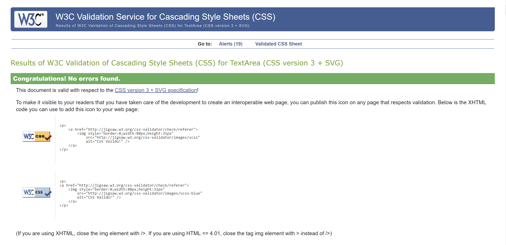
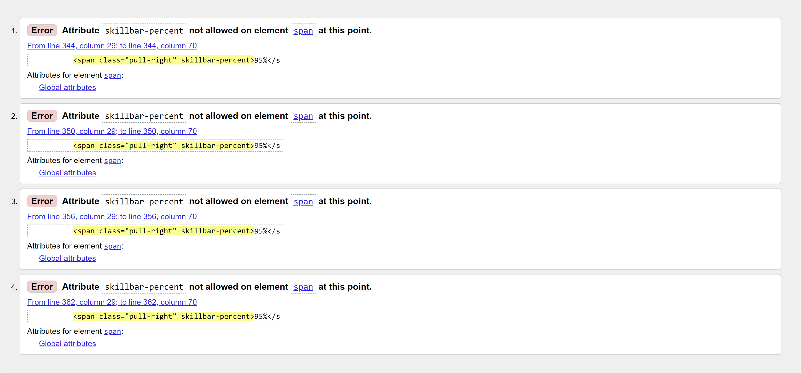

# **My First Website**

#

#

This project was created as part of the Full Stack Software Development course offered by Code Institute.  
It is a single page website made of multiple sections: Home section, About Us section, Services section, Statistics section, Team section, Prices section, Testimonials section, Blog section, Clients section, Contact section.

[Live Preview](https://yari-carelli.github.io/My-First-Website/)

#

## Purpose of the Project

- Build a static front-end site to present useful information to users, using HTML and CSS as main technologies
- Design an interactive Front-End web application using HTML and CSS based on the principles of user experience design, accessibility and responsivity
- Test a Front-End web application through the development, implementation and deployment stages
- Deploy a Front-End web application to a Cloud platform
- Maximise future maintainability through documentation, code structure and organisation
- Demonstrate and document the development process through a version control system such as GitHub

#

## User Stories

- As a Site User, I want to understand the website, so I can learn more about the brand.
- As a Site User, I want to be able to easily navigate through the website, so I can find the information I am looking for.
- As a Mobile Device User, I want the website to be responsive, so I can use my phone or tablet to easily visit it.
- As a Site User, I want to be able to send a message by filling the form provided, so I can contact the company for business inquiries.

#

## Features

### Navigation
- Featured at the top of the page, the Navigation shows the company name and logo in the left corner
- All the navigation links are to the right, which link to different sections of the same page
- The Navigation is in a color that contrasts with the background
- The Navigation makes the different sections of information easy to find
- The Navigation bar is fixed on top to facilitate users to navigate through pages easily

### Home Section
- The Header is in a large font-size to catch the user's attention and make the purpose of the website immediately understood by the user
- The Header briefly explains what the website is about
- The Home section features social media icons which ideally link the website to its profiles on the different social media platforms
- Two buttons invite the user to extend their stay on the site

### About Us Section

- The About Us section gives details about what the company offers their clients
- This section shows the user the important information they need to know about the company
- An image on the right side recalling the website's theme colors has a clickable icon on the center, featuring a sonar wave animation. By clicking on the icon, the user is ideally linked to a presentation video of the company; at the moment, the link is set to Youtube's homepage

### Services Section
- By visiting this section, the user becomes familiar with all the different services the company provides
- The services are organized in a two-rows layout, and each service is embellished with a specific icon

### Statistics Section
- The number counting fuctionality was realized using the JQuery counting up plugin 'Counter Up 2'

### Team Section
- This section provides information about the company's team members.
- Artistic and dark pictures to increase contrast, together with smooth hover effects make this section more appealing

### Pricing Plans Section
- 

### Testimonials Section

### Blog Section

### Clients Section
- Made with the jQuery plugin 'Owl Carousel' that lets you create a beautiful, responsive carousel slider

### Contact Section

#

## Technologies Used

- HTML5 → for the webpage's markup language
- CSS3 → to format the webpage's layout
- Bootstrap → for responsiveness
- JavaScript → for Sticky Header and Navigation Menu, Statistics Section, Client Section
- Ionicons (https://nbs-it.github.io/ionicons-v2.0.1/) & Font Awesome Icons (https://fontawesome.com/) → for icons
- Google Fonts (https://fonts.google.com/) → for typography
- jQuery counting up plugin 'Counter Up 2' (https://github.com/bfintal/Counter-Up2) → for number counting in Statistics Section
- jQuery plugin Owl Carousel 2 (http://owlcarousel2.github.io/OwlCarousel2/) → for carousel slider in Clients Section

#

## Manual Testing

- I have tested that this webpage works in different browsers: Chrome, Firefox, Safari

- I have confirmed that this project is responsive, looks good and functions on all standard screen sizes using the devtools device toolbar.

- I have confirmed that the navigation and all the sections of the website are readable and easy to understand

- I have confirmed that all the functionalities implemented work correctly

- I have confirmed that the form works: requires entries in every field, will only accept an email in the email field, and the submit button works 

#

## Validator Testing

- HTML
   - Results returned when passing through the official W3C HTML Validator can be viewed by clicking on the link below:

   (https://validator.w3.org/nu/#textarea)

- CSS
   - No errors were found when passing through the official W3C CSS Validator (Jigsaw)

- Accessibility
   - I confirmed that the colors and fonts chosen are easy to read and accessibile by running it through Lighthouse in devtools

#

## Fixed Bugs

- Overlapsing issue causing horizontal scroll on small screen sizes

- The errors shown in the screenshot below resulted when passing through the official W3C HTML Validator.  
An attempt to solve the errors consisted in changing the aforementioned `span` element into a `div` element, however the same error was returned when passing through the Validator again.  
Therefore, the errors have been purposely ignored as they do not affect code functionality.

#

## Gitpod Reminders

To run a frontend (HTML, CSS, Javascript only) application in Gitpod, in the terminal, type:

`python3 -m http.server`

A blue button should appear to click: _Make Public_,

Another blue button should appear to click: _Open Browser_.

To run a backend Python file, type `python3 app.py`, if your Python file is named `app.py` of course.

A blue button should appear to click: _Make Public_,

Another blue button should appear to click: _Open Browser_.

