# **My First Website**

#

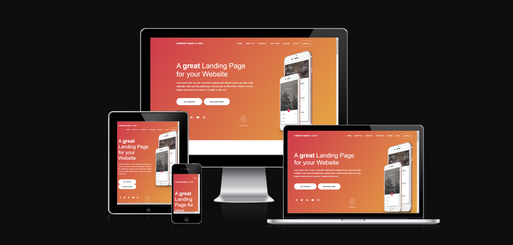

#

This project was created as part of the Full Stack Software Development course offered by Code Institute.  
It is a single page website made of multiple sections: Home section, About Us section, Services section, Statistics section, Team section, Prices section, Testimonials section, Blog section, Clients section, Contact section.

[Live Preview](https://yari-carelli.github.io/My-First-Website/)

#

## Purpose of the Project

- Build a static front-end site to present useful information to users, using HTML and CSS as main technologies
- Design an interactive Front-End web application using HTML and CSS based on the principles of user experience design, accessibility and responsivity
- Test a Front-End web application through the development, implementation and deployment stages
- Deploy a Front-End web application to a Cloud platform
- Maximise future maintainability through documentation, code structure and organisation
- Demonstrate and document the development process through a version control system such as GitHub

#

## User Stories

- As a Site User, I want to understand the website, so I can learn more about the brand.
- As a Site User, I want to be able to easily navigate through the website, so I can find the information I am looking for.
- As a Mobile Device User, I want the website to be responsive, so I can use my phone or tablet to easily visit it.
- As a Site User, I want to be able to use the contact form, so I can send a message to the company for business inquiries.

#

## Features

### Navigation
- Featured at the top of the page, the Navigation shows the company name and logo in the left corner
- All the navigation links are to the right, which link to different sections of the same page
- The Navigation is in a color that contrasts with the background
- The Navigation makes the different sections of information easy to find
- The Navigation bar is fixed on top to facilitate users to navigate through pages easily
- The links are animated on hover
- The Navigation bar is responsive and appears in a form of a hamburger menu on mobile devices

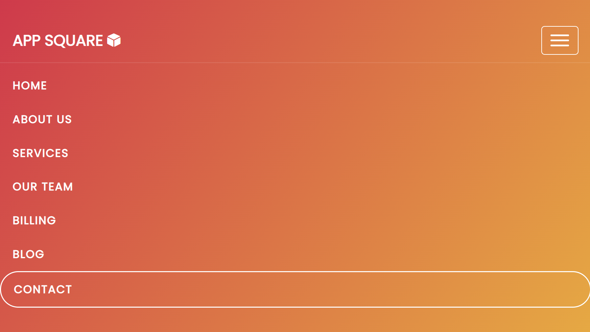

### Home Section
- The Home section has a colorful gradient background
- The Header is in a large font-size to catch the user's attention and make the purpose of the website immediately understood by the user
- The Header briefly explains what the website is about
- The Home section features social media icons which ideally link the website to its profiles on the different social media platforms
- Two buttons invite the user to extend their stay on the site, and have simple hover effects
- Features an animated scroll button element with simple hover effects
- The Home section is responsive: both the main images on the right side and the animated scroll button element disappear on mobile devices

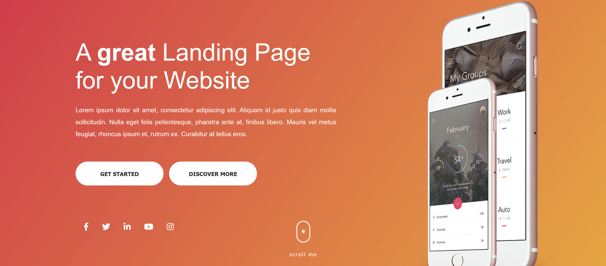

### About Us Section

- The About Us section provides details about what the company offers their clients
- This section contains the important information the user needs to know about the company
- An image on the right side recalling the website's theme colors has a clickable icon on the center, featuring a sonar wave animation. By clicking on the icon, the user is ideally linked to a presentation video of the company; at the moment, the link is set to Youtube's homepage

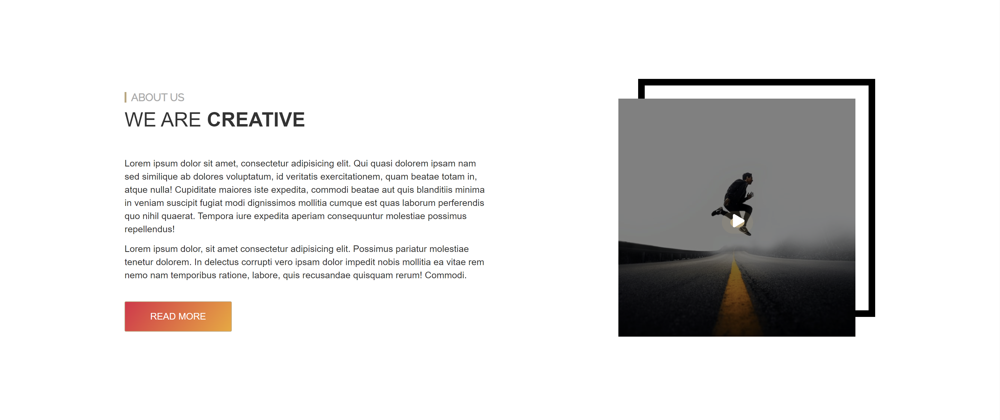

### Services Section
- By visiting this section, the user becomes familiar with all the different services the company provides
- The services are organized in a two-rows layout, and each service is embellished with a specific icon

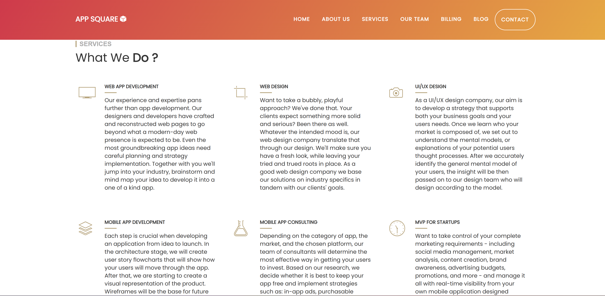

### Statistics Section
- The number counting fuctionality was realized using the JQuery counting up plugin 'Counter Up 2'

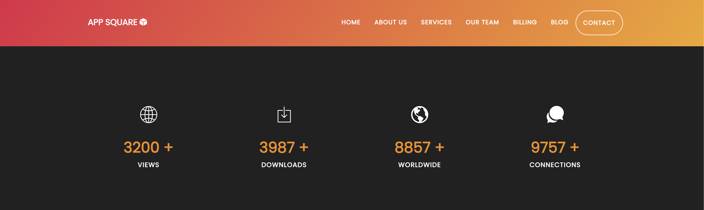

### Team Section
- This section provides information about the company's team members.
- The section contains four team member cards, which are animated on hover
- When hovered on, each card provides the team member's contact details and general information, such as full name and job role
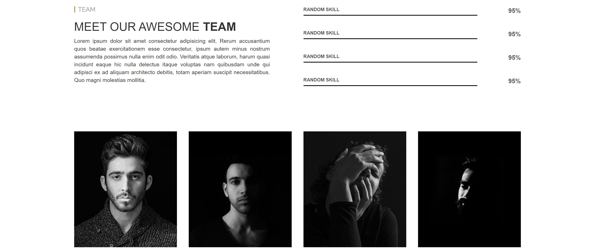

### Pricing Plans Section
- Features three cards containing pricing plan details; each card is animated on hover
- Each card is provided of a button, which invites the user to purchase the plan
- Buttons' background and navbar are the same color

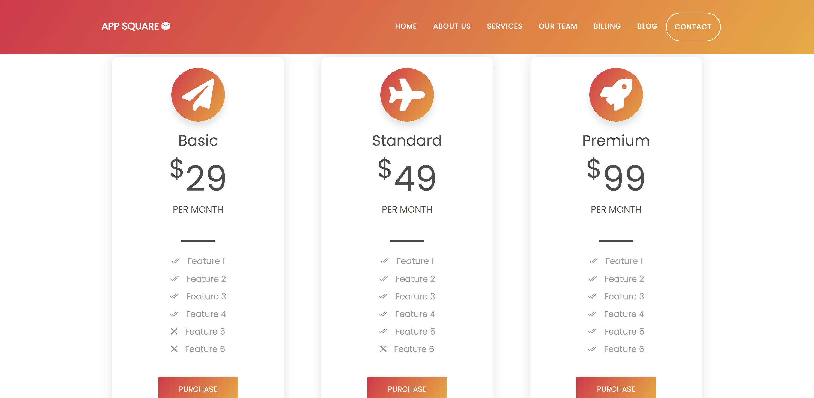

### Testimonials Section

### Blog Section
- The Blog Section provides the latest news about the company and its activities
- Features three cards, which are animated on hover
- Each card contains an image, a brief text, and a button, which has hover effects

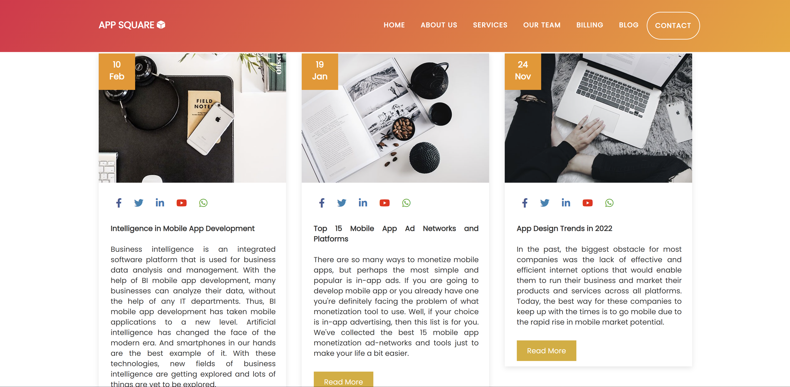

### Clients Section
- Made with the jQuery plugin 'Owl Carousel' that lets you create a beautiful, responsive carousel slider

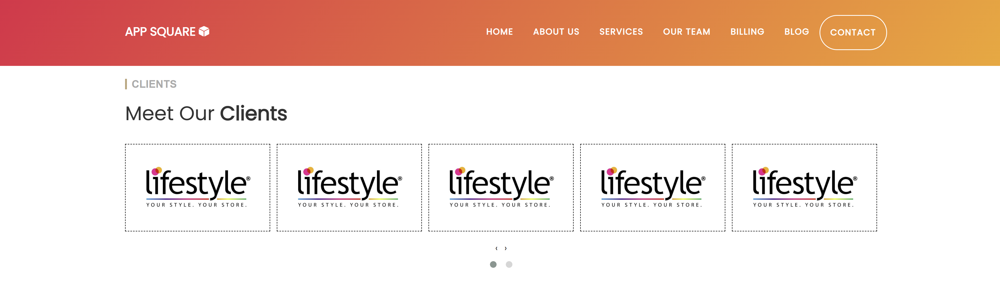

### Contact Section
- The Contact section encourages users to get in contact and provides a phone number, email address and street address where the company can be found
- The Contact section includes a form on the right side to allow the user to send a message to the company
- All fields of the form must be filled in order to send a message
- A red alert message appears if the user clicks on the 'Send' button while there are empty fields
- A green confirm message appears when the message is sent correctly
- The Contact section is valuable to the user as it gives them the ability to find and contact the company if they need to

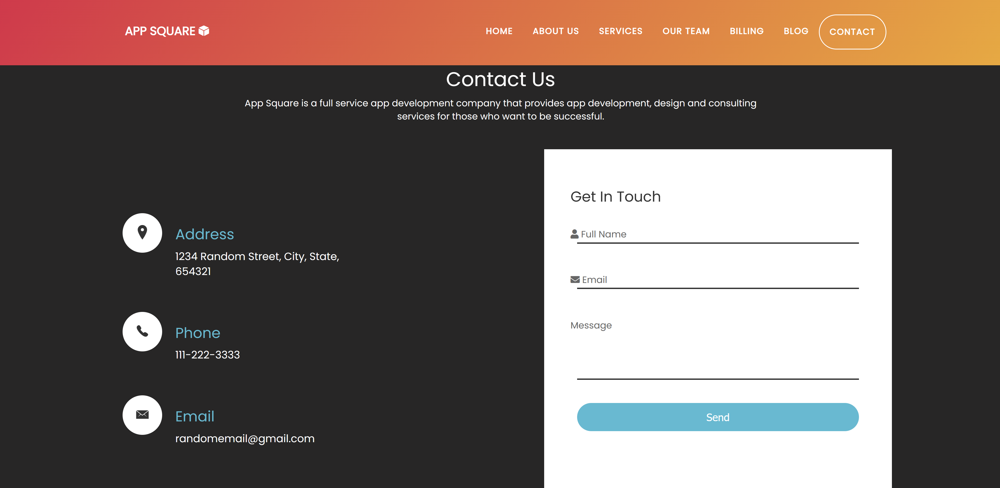

#

## Technologies Used

- HTML5 → for the webpage's markup language
- CSS3 → to format the webpage's layout
- Bootstrap → for responsiveness
- JavaScript → for Sticky Header and Navigation Menu, Statistics Section, Client Section
- Ionicons (https://nbs-it.github.io/ionicons-v2.0.1/) & Font Awesome Icons (https://fontawesome.com/) → for icons
- Google Fonts (https://fonts.google.com/) → for typography
- jQuery counting up plugin 'Counter Up 2' (https://github.com/bfintal/Counter-Up2) → for number counting in Statistics Section
- jQuery plugin Owl Carousel 2 (http://owlcarousel2.github.io/OwlCarousel2/) → for carousel slider in Clients Section
- Unsplash (https://unsplash.com/images) → for images

#

## Manual Testing

- I have tested that this webpage works in different browsers: Chrome, Firefox, Safari
- I have confirmed that this project is responsive, looks good and functions on all standard screen sizes using the devtools device toolbar
- I have confirmed that the navigation and all the sections of the website are readable and easy to understand
- I have confirmed that all the functionalities implemented work correctly
- I have confirmed that the form works: requires entries in every field, will only accept an email in the email field, and the submit button works 

#

## Validator Testing

- HTML
   - No errors were found when passing through the official W3C HTML Validator

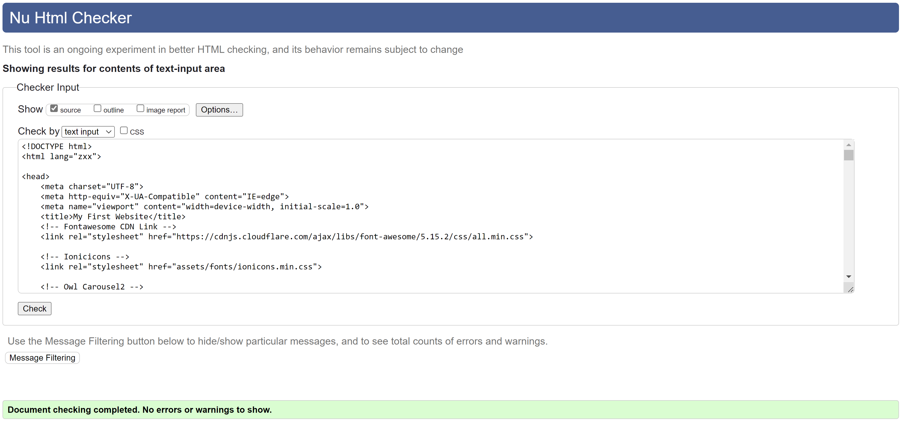

- CSS
   - No errors were found when passing through the official W3C CSS Validator (Jigsaw)

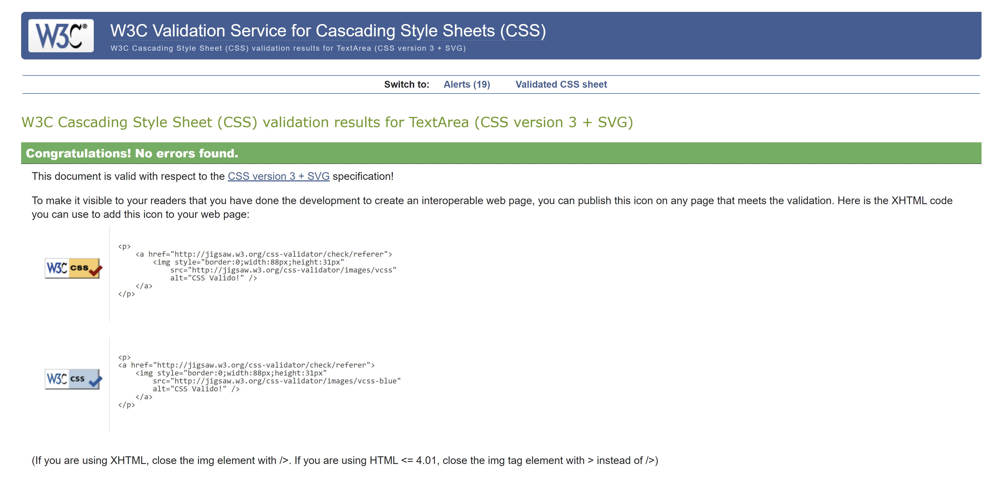

- Accessibility
   - I confirmed that the colors and fonts chosen are easy to read and accessibile by running it through Lighthouse in devtool5

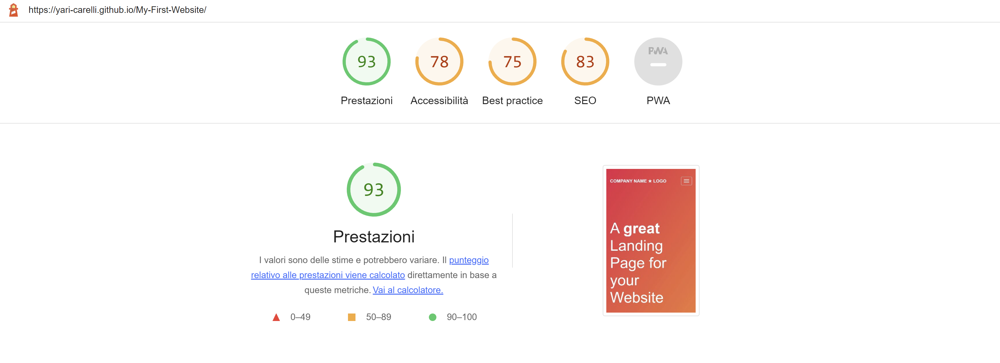

#

### Unixed Bugs

- No unfixed bugs

#

## Deployment

- The site was deployed to GitHub pages.  
The steps to deploy are as follows:
   - In the GitHub repository, navigate to the Settings tab
   - From the source section drop-down menu, select the 'main' Branch
   - Once the main branch has been selected, the page provided the link to the completed website.

The live link can be found here [My First Website](https://yari-carelli.github.io/My-First-Website/)

#

## Gitpod Reminders

To run the project in Gitpod, in the terminal, type:

`python3 -m http.server`

